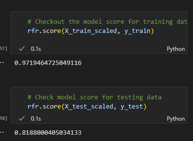
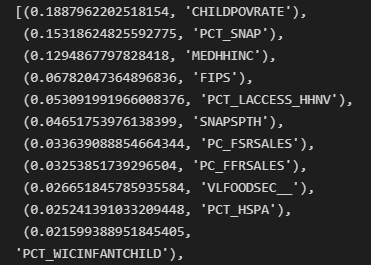

## Outline of the Project

The root of the project was an interesting phenomenon that has been studied more and more lately called Food Desserts. 

These are defined by the communities access to nutritious food. A place is categorized as a food dessert depending on a number of factors including the amount and type of stores that sell food in the area. There is still much discussion and debate over what exactly should be called a “ffood dessert”
In an effort to define the term better the University of Michigan conducted a study in ten counties in Michigan that had areas within them that they believed to be food dessert. They broke down the counties into even smaller geographic areas, all the way down to individual neighborhoods, classified some as food desserts and collected extremely detailed information on the health metrics of the population. One thing was abundantly clear. Residents of these “food dessert” we in worse health than resident outside of the areas.

Initially we hoped to build a model off of this data that we could extrapolate to a larger, even nationwide dataset. After discussions with instructors we determined that It would be difficult to get meaningful insights that could be applied to a dataset as broad as the entire nation.

When we realized that the UofM data would be difficult if not impossible to draw any actionable conclusions from we shifted our focus to trying to learn something about what factors in community make it residents unhealthy. Thankfully the United States Department of Agriculture regularly publishes what it calls it Food Atlas. It contains data for the entire nation broken down to mostly the county level and includes statistics for many of the same factors UofM was studying.

Besides environment and socioeconomic statistics the Food Atlas also includes Two key indicators of health; obesity  and diabetes.udes Two key indicators of health; obesity  and diabetes. 

With the help of data in the USDA's Food Atlas we sought to understand what factors within a community were common among areas with poor health.


## DRAFTS

#### Data Source
#### Data Source


## Entity Relationship Diagram
### (A map of the realtionships within our database)
* The data we were looking to extract was spread over nine different sheets within the MS Excel file that contained the entire Food Atlas. We extracted each sheet as a separate pandas dataframe and then exported each dataframe to a separate csv file without doing any further processing within pandas.

```
{
    ### USE THE LISTS ABOVE TO CREATE DATAFRAMES FROM EACH SHEET ###

population_df = global_dict['Supplemental Data - County'][POPULATION_LIST]
access_df = global_dict['ACCESS'][ACCESS_LIST]
store_df = global_dict['STORES'][STORES_LIST]
restaurants_df = global_dict['RESTAURANTS'][RESTAURANTS_LIST]
assistance_df = global_dict['ASSISTANCE'][ASSISTANCE_LIST]
insecurity_df = global_dict['INSECURITY'][INSECURITY_LIST]
local_df = global_dict['LOCAL'][LOCAL_LIST]
health_df = global_dict['HEALTH'][HEALTH_LIST]
socioeconomic_df = global_dict['SOCIOECONOMIC'][SOCIOECONOMIC_LIST]

#access_df.head()
}
```

```
{## Output the dataframes to csv files ##

population_df.to_csv('data/ATLAS/population.csv')
access_df.to_csv('data/ATLAS/access.csv')
store_df.to_csv('data/ATLAS/stores.csv')
restaurants_df.to_csv('data/ATLAS/restaurants.csv')
assistance_df.to_csv('data/ATLAS/assistance.csv')
insecurity_df.to_csv('data/ATLAS/insecurity.csv')
local_df.to_csv('data/ATLAS/local.csv')
health_df.to_csv('data/ATLAS/health.csv')
socioeconomic_df.to_csv('data/ATLAS/socioeconomic.csv')
}
```

* We chose to do it this way to fulfil the rubric requirement that we have multiple tables in our database and that we perform at least some kind of join within our database.


### Preliminary Data Processing


* The data we were looking to extract was spread over nine different sheets. We extracted each sheet as a separate pandas dataframe and then exported each dataframe to a separate csv file without doing any further processing withing pandas.
* We chose to do it this way to fulfil the rubric requirement that we have multiple tables in our database and that we perform at least some kind of join within our database.


### Feature Selection
* Across the nine sheets we created, there were 73 distinct features. We selected columns from the Atlas data that would hopefully give us insights into the food environment for each row. These features included data related to the density food retailers in the county broken down by establishment type, data related to the overall health of the area, population data, and some socioeconomic factors.
* After exploring the data we had we decided to drop a few columns we had initially selected because they had too many null values to be of any use to us.
### Feature Engineering
* For many of these measures we had matched pairs of data with results from 2 different years. Ultimately, we decided to average those pairs as part of our standardization and feature engineering.


* The other engineering we did before feeding our data into the machine learning model was to standardize it using the StandardizedScaler from the sklearn module. We then used the train_test_split function from sklearn to split our data into training and testing sets. We used the standard parameters to do the split.


### Model Selection and EDA
* After a discussion with the instructor, we were convinced to try a Random Forest Regressor to model our data. RFR is a supervised learning algorithm that allows us to test for a single target variable and through an ensemble learning method of using diverging decision trees arrives at a weighted average for our independent variables to give us an insight on what independent variables contribute the most to our target feature.

* We ran the RFR for two possible target variables. 

When we targeted obesity rate we were able to saw some off the charts accuracy scores


The RFR model identified these as the top factors contributing to high obesity


The problem with this approach is that the dataset only had obesity rates at the state level. 

When we changed the target to diabetes rate, which we had values for at the county level the model score predictably fell




A score of .81 is not optimal but when we considered the scope data and the difficulty of predicting such a difficult variable we felt that some insights might still be gained from our imperfect model. 

Unfortunately the time frame of the project meant we were unable to continue to work on our model. In an ideal situation we would have been able to try different paramenters for our RFR model and been able to go back to the data engineering phase to compile different sets of factors and run them through our model to look for more and stronger relationships. 


## Conclutions

While both of our models were imperfect for the reasons mentioned above by looking at the results of both we were able to make some interesting conclusions. There were a number of factors that were shared between the two models. Most of the factors identified in both models were related to the socioeconomic makeup of the area. 

The thing that stood out to us were the shared factors that didn't have an obvious tie to the socioeconomic makeup of the county. 

Here are the top contributing factors for both obesity and diabetes rates that we identified in simpler terms. The bolded factors are shared between both models and the factors highlighted in red are the ones that stood out as interesting and we wanted to focus on in the reporting phase of the project.


We realized that spending on prepaired food per capita, either from a fast food establishment and/or a full service restuarant, was closely tied to the key health metrics of the community. That conlutions came as a surprise and seemed worthy of summary and visualization.

## Summary

When looking at ways to summarize our findings first we tried creationg simple summary plots using seaborn and matplotlib within python.

Eventually we settled on using Tablaeu Public because of it's robust mapping capabilities, built in styles, and it's ability to easily integrate with HTML.

///EXAMPLE TAB MAPS

We created a website using _____________________


/// LINK TO SITE


### DRAFT

Our data analysis yielded some interesting results. The RFR model found that the feature that most contributed to obesity rate was Expenditure per capita at full service restaurants. The measure of expenditure per person at fast food restaurants ranked fifth in our models weight of importance. 

The categories that ranked second, third and fourth by order of importance all relate to the poverty level of the locale. Two were measure of the percentage of the population that receives federal food assistance in the form of WIC or SNAP benefits. The other measure the factor called Household Food Insecurity.

* While it isn't surprising that many of the factors that contribute the most to bad health at the county level are poverty related. What is interesting and worthy of more exploration is why these three factors in particular stood out when there were a number of other metrics about poverty, including a few that directly measured the poverty rate. 


## Summary and Conclutions

////TABLAUE BOOK

